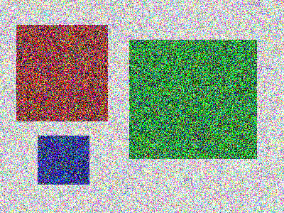
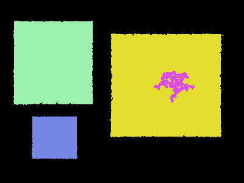
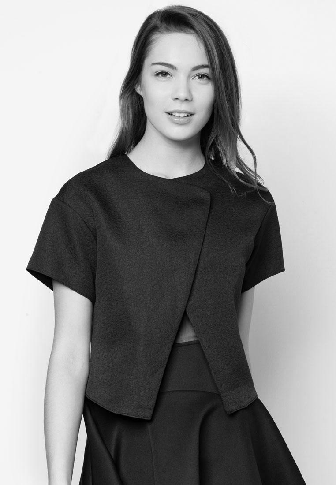
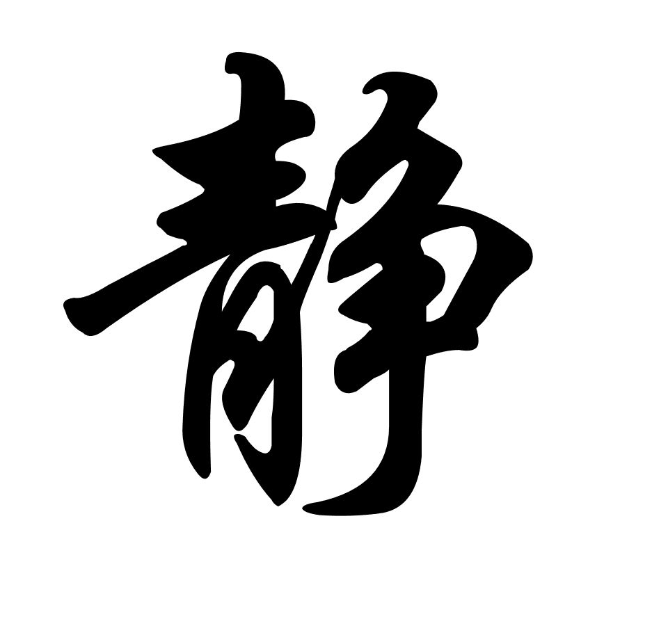
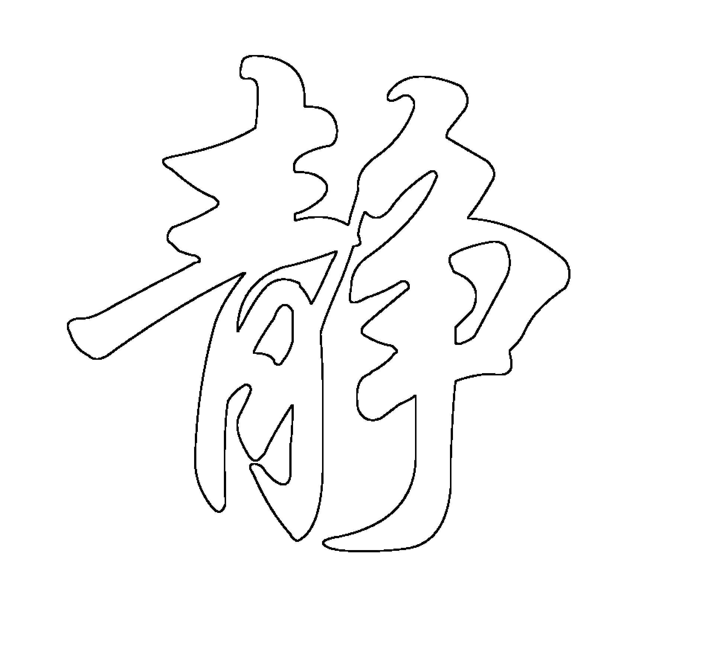

# 实验2

1. 对一张模糊图像分割出物体，然后将它们重新绘制到具有独特颜色的新图像上。具体目标是仅绘制面积大于1,000像素的大型物体。此外，每个物体都需要具有自己的颜色。

   目标模糊图像

   

   结果示例图像（达成要求即可，不需要完全一致）

   

2. 以下两题二选其一即可

   (1) 改变目标图像背景

   目标图像

   

   结果示例图像（达成要求即可，不需要完全一致）
   
   
   
   (2)
   
   基于数字形态学的空心字转换
   
   将汉字图像
   
   
   
   转化为空心字，结果如下
   
   

进阶实验：

使用模板匹配去除图像水印

